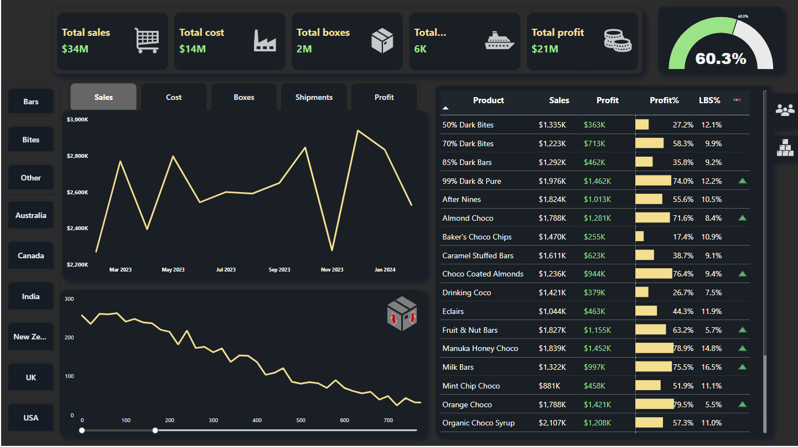

#  Chocolate Company Sales Insights Dashboard

##  Overview
This Power BI dashboard provides an in-depth analysis of sales performance for a chocolate manufacturing company. It highlights key business metrics, trends, and regional breakdowns to help stakeholders monitor performance and make data-driven decisions.

---

## Key Metrics Tracked

- Total Sales: $34M  
- Total Cost: $14M  
- Total Boxes Sold: 2M  
- Total Shipments: 6K  
- Total Profit: $21M  
- Profit Margin: 60.3%

---

##  Dashboard Sections

###  Top KPIs (Cards)
Summarizes the business's financial and operational performance:
- Sales
- Cost
- Boxes
- Shipments
- Profit
- Profit Margin

###  Trends Analysis (Line Chart)
- Monthly performance of Sales, Cost, Boxes, Shipments, and Profit.
- Filtered by region and product categories (Bars, Bites, Other).

###  Sales by Region
Tracks product-wise sales and shipment distribution by countries:
- Australia
- Canada
- India
- New Zealand
- UK
- USA

---

##  Purpose
This dashboard helps in:
- Monitoring profitability and operational efficiency
- Identifying top-performing regions and products
- Analyzing trends and changes in sales over time
- Recognizing individual contributions from sales representatives

---

##  Tools Used
- Power BI Desktop
- DAX for KPI and measure creation
- Custom visuals (cards, gauges, slicers, etc.)
- Dark theme UI for a professional look

---

## Last Updated
June 25, 2025
